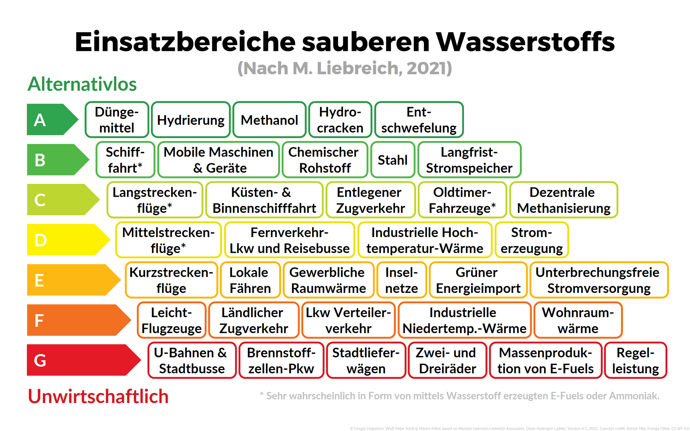

# Elektro ist ein wichtiger Teil der Antriebswende

E-Autos sind wichtiger Teil der [Antriebswende](../Antriebswende). Die von dir geforderten synthetischen Kraftstoffe / Wasserstoff haben in der Herstellung einen deutlich höheren Energieverbrauch. Wir sollten sie daher dort einsetzen, wo eine Elektrifizierung nicht möglich ist (Schiffsfahrt, Flugverkehr,...). Herbert Diess erklärt das ganz gut in [diesem Ausschnitt von Lanz](https://twitter.com/NurderK/status/1420516148446105604?ref_src=twsrc%5Etfw%7Ctwcamp%5Etweetembed%7Ctwterm%5E1420516148446105604%7Ctwgr%5E%7Ctwcon%5Es1_&ref_url=https%3A%2F%2Fwww.mobiflip.de%2Fshortnews%2Fvolkswagen-herbert-diess-zerstoert-wasserstoff-argument%2F).

![[1307.jpg]]

Eingeteilt nach Wirtschaftlichkeit ergibt sich:

# Die Ladeinfrastruktur muss ausgebaut werden

Du hast insofern Recht, als dass die Ladeinfrastruktur deutlich ausgebaut werden muss. Mieter:innen haben kaum die Möglichkeit, sich eigene Wallboxen nachzurüsten. Die Politik ist gefordert, durch Rahmenbedingungen und Anreize für die entsprechende Ladeinfrastruktur zu sorgen. Damit die Politik jedoch tätig wird, brauchen wir Commitment und Leadership statt des abgedroschenen Rufs nach Technologieoffenheit.

### Über allem steht die Verkehrswende

Die [Antriebswende]() ist natürlich nur ein Teil der [[Verkehrswende]]. Unvergleichlich wichtiger ist der Wechsel hin zu mehr Bahnverkehr, besserer Fahrrad- und ÖPNV-Infrastruktur und Carsharing-Konzepten, damit wir unsere Innenstädte nicht mehr mit Blechkisten vollstellen, die **95%** der Zeit nur herumstehen und uns Platz wegnehmen.

### Agora Energiewende

Wie Energiewende und Verkehrswende zusammen gelingen können zeigt Agora Energiewende [in ihrem Video](https://www.youtube.com/watch?v=UixHyJO7zmg).

### Einfluss des Verkehrssektors und Möglichkeiten entsprechend dem [[IPCC]]-Bericht

[Revolutionary changes in transportation, from electric vehicles to ride sharing, could slow global warming – if they’re done right, IPCC says](https://theconversation.com/revolutionary-changes-in-transportation-from-electric-vehicles-to-ride-sharing-could-slow-global-warming-if-theyre-done-right-ipcc-says-179535)
