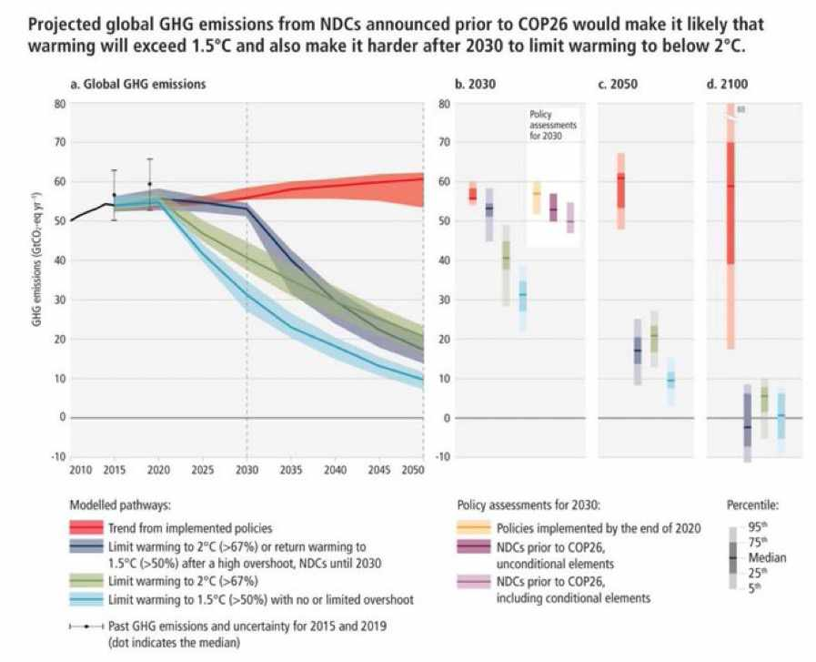
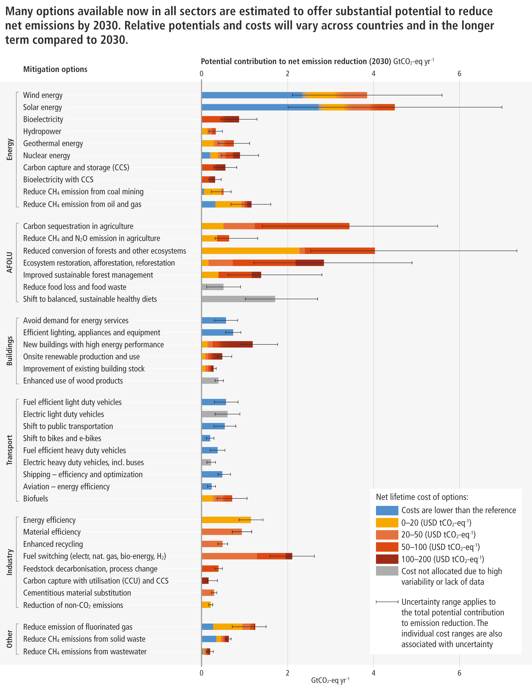

# Einordnung des [IPCC](IPCC.md) Berichts von April 2022

> „Die Jury hat ihr Urteil gefällt und es ist ein verheerendes Urteil. Wir gehen auf eine unvorstellbare Welt zu.“ - Antonio Guterres zum [IPCC](IPCC.md)

Statt entsprechend 1,5 Grad Ziel zu reduzieren (blau), bleiben weltweite Emissionen nach aktuell wahrscheinlichstem Szenario bis 2050 konstant (rot). Das führt zu **+3,2** Grad bis 2100: https://twitter.com/DrSimEvans/status/1510995652066619396

Jetzt bleibt: entschlossenes Handeln. Um jedes Zehntel Grad kämpfen. **Kosten für Erneuerbare sind in den letzten 10 Jahren um 85% gesunken**.

# Handlungsoptionen entsprechend dem Bericht

Größtes Einsparpotential von Emissionen: Nutzung von Erneuerbaren und Stopp der Abholzungen in der Landwirtschaft #vegan

Wie Klimawissenschaftler [[Peter Kalmus]] es formuliert:

> Wir verlieren die Erde unwiderruflich und aus den idiotischsten Gründen: den Reichen.

Die **reichsten 10% tragen fast die Hälfte** zu den globalen Treibhausgasemissionen bei, während die ärmsten 10% der Welt weniger als 5% beitragen.

Lasst uns nicht alles sehenden Auges in den Sand setzen. Bitte. Sind viele Krisen aktuell und es werden mehr. Die Lösungen sind da. [Erneuerbare](Erneuerbare.md) [vegan](vegan.md) [CO2-Preis](CO2-Preis.md) [[Energiegeld]] [Vermögenssteuer](Verm%C3%B6genssteuer.md)
